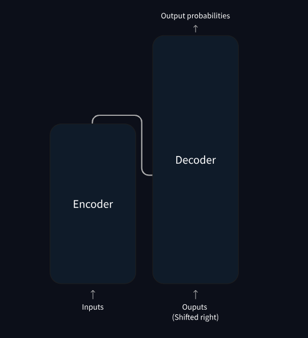
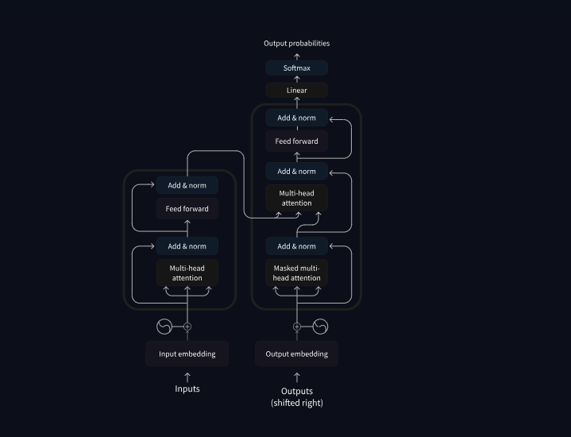

 
## How do Transformers work?



transformer的Encoder和Decoder部分可以分开使用，也可以一起使用
Each of these parts can be used independently, depending on the task:

1. Encoder-only models: Good for tasks that require understanding of the input, such as sentence classification and named entity recognition.

2. Decoder-only models: Good for generative tasks such as text generation.

3. Encoder-decoder models or sequence-to-sequence models: Good for generative tasks that require an input, such as translation or summarization.


### **三种模式的代表作就是GPT，BERT，T5**:
```
1. BERT 是做“完形填空”（看到全句，只补其中被遮盖的词）。Encoder-only； masked language modeling; 文本分类、命名实体识别、语义相似度计算等**理解类任务**

2. GPT 是做“续写填空”（只能看到左边，不断向右写新词）。Decoder-only；
causal language modeling：the output depends on the past and present inputs, but not the future ones.
文本生成、对话、续写、代码生成等**生成任务**

3. T5 是做“改写填空”（输入一个带噪声的句子，输出完整的改正后句子）。Encoder-Decoder;根据输入生成输出的任务，目标：去噪自编码
```

**attention layers** : will tell the model to pay specific attention to certain words in the sentence you passed it

### paper list:
```
BERT: Pre-training of Deep Bidirectional Transformers for Language Understanding
DistilBERT, a distilled version of BERT: smaller, faster, cheaper and lighte
GPT-1:Improving Language Understanding by Generative Pre-Training
GPT-2:Language Models are Unsupervised Multitask Learners
Exploring the Limits of Transfer Learning with a Unified Text-to-Text Transformer
BART: Denoising Sequence-to-Sequence Pre-training for Natural Language Generation, Translation, and Comprehension
```



## How 🤗 Transformers solve tasks

>**follow a similar pattern, different is :**
>1. the data is prepared
>2. what model architecture variant is used
>3. how the output is processed.

GPT2 uses byte pair encoding (BPE) to tokenize words and generate a token embedding.
what is byte pair encoding (BPE)

BERT uses WordPiece tokenization, user [SEP] (句子之间的连贯性和逻辑关系) and mask language modeling learning 单词的意思（通过掩码语言建模）， 

identifying the most relevant words to predict the next token 